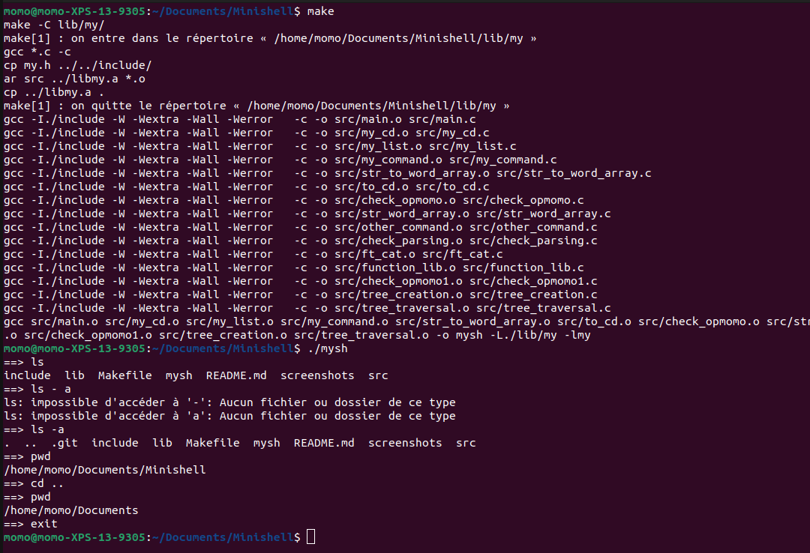

# Minishell I

Le but de ce projet est de créer un Shell, qui est le plus au niveau du système Unix, c'est un programme qui va permettre d'interpréter une commande, qui va ensuite la parser et l'exécuter.

Le but va être d'en boucle toutes les entrées de l'utilisateur; puis parser la commande inscrite par l'utilisateur, exécuter la commande.

Il va falloir faire une gestion de l'environnement, implémenter les builtins et faire une gestion erreurs.


Le but du projet, minishell est de créer shell qui va interpreter des commandes simples sans separateur (une commande à la fois).

## But du programme

Minishell : créer un shell, et interpreter des commandes. (reproduction de BAsh).

## Fonctions autorisées

```
	• malloc, free, exit, opendir, readdir, closedir, getcwd, chdir
	• fork, stat, lstat, fstat, open, close, getline, strtok, strtok_r
	• read, write, execve, access, isatty, wait, waitpid
	• wait3, wait4, signal, kill, getpid, strerror, perror, strsignal
	• pipe, dup, dup2
	
```

## Mise en route

Ces instructions vous permettront d'obtenir une copie du projet opérationnel sur votre machine locale à des fins de développement et de test.

### Pré-requis

De quoi avez-vous besoin pour installer le logiciel et comment l'installer ?

```
gcc
make
```

### Installation

Compilation du projet

```
make
```

Lancement du projet

```
./mysh

```

## Captures d'écrans

Exemple execution d'une commande :



